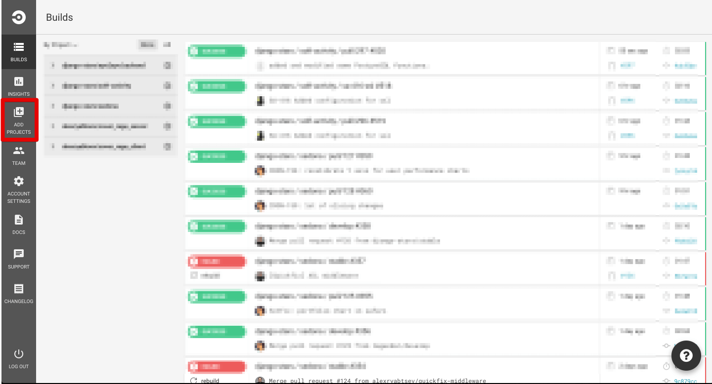
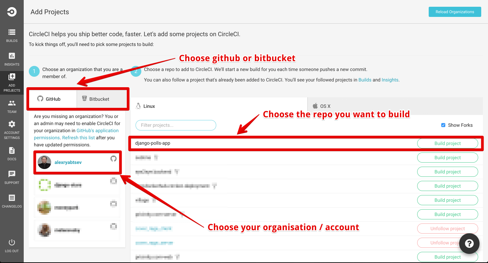
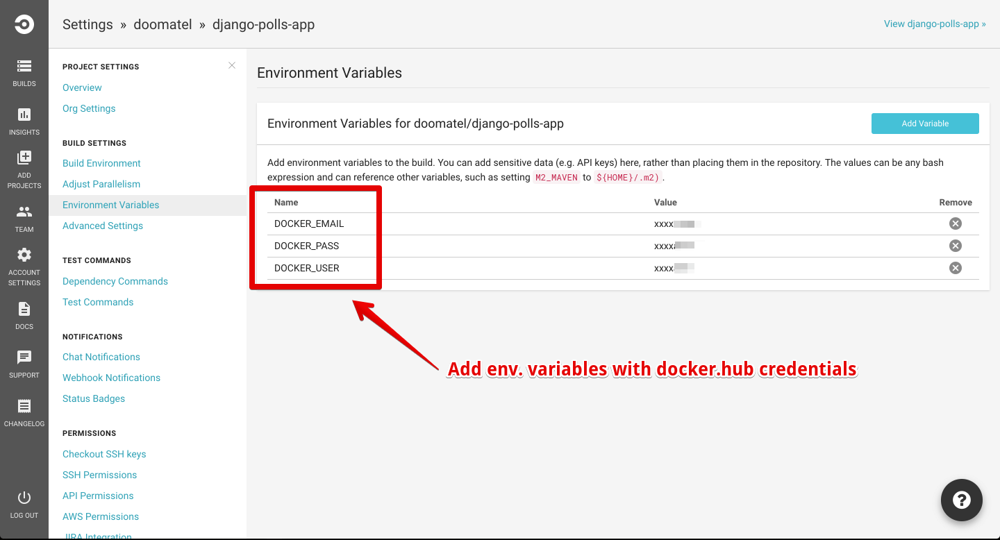
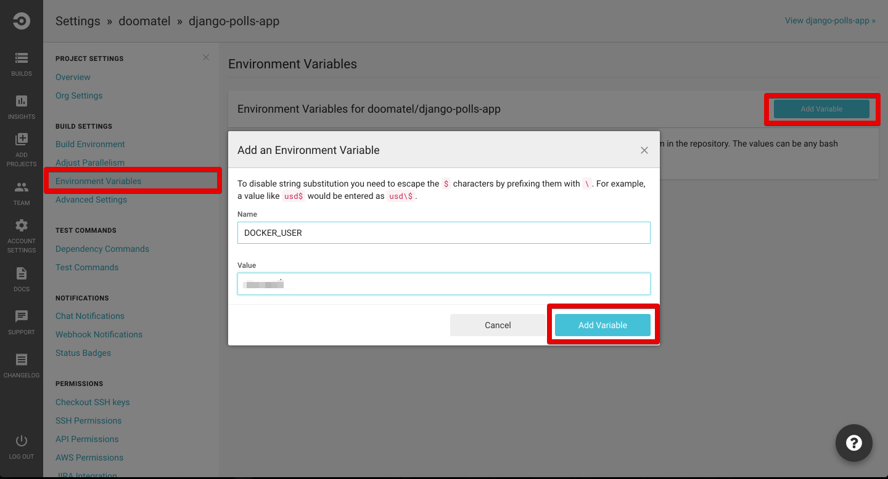
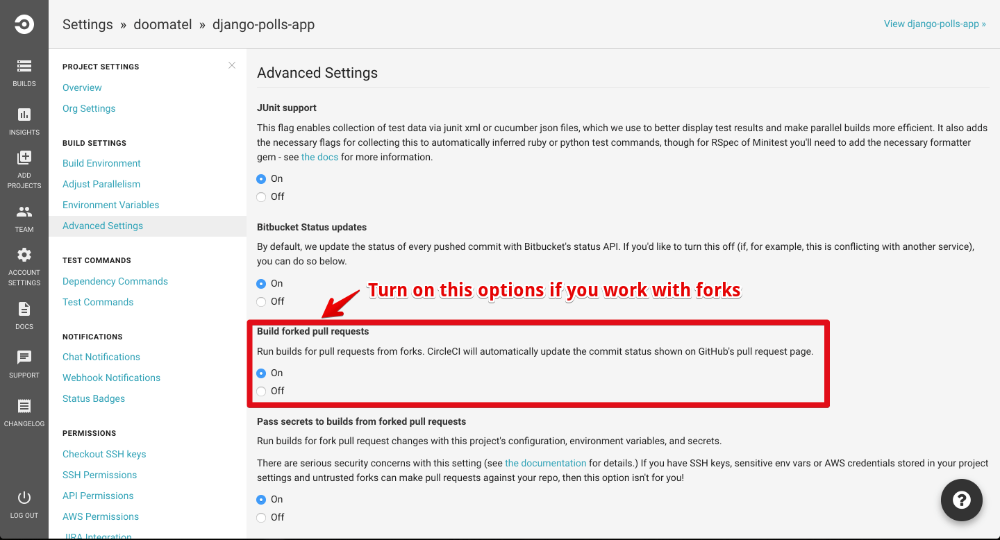
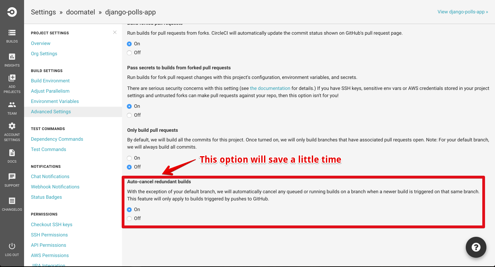
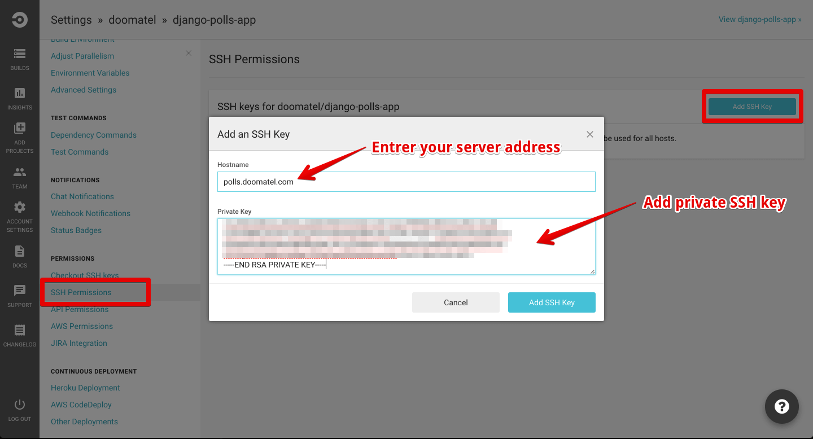

CircleCI configuration
======================

1) Go to [circleci.com](https://circleci.com/).

2) Sign up with your github or bitbucket account.

3) Click on button `Add projects`:

4) Find repo you want to add:

5) Add Docker Hub credentials into `Environment variables`:

6) Add some `Advanced settings`:

7) Add SSH key to your server:

